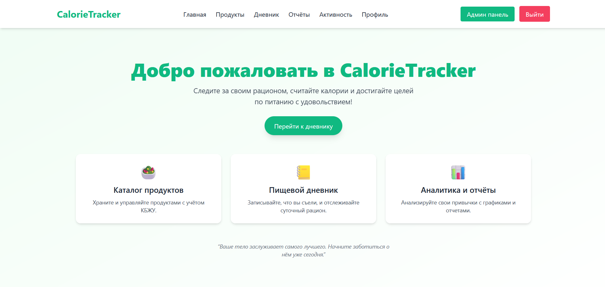
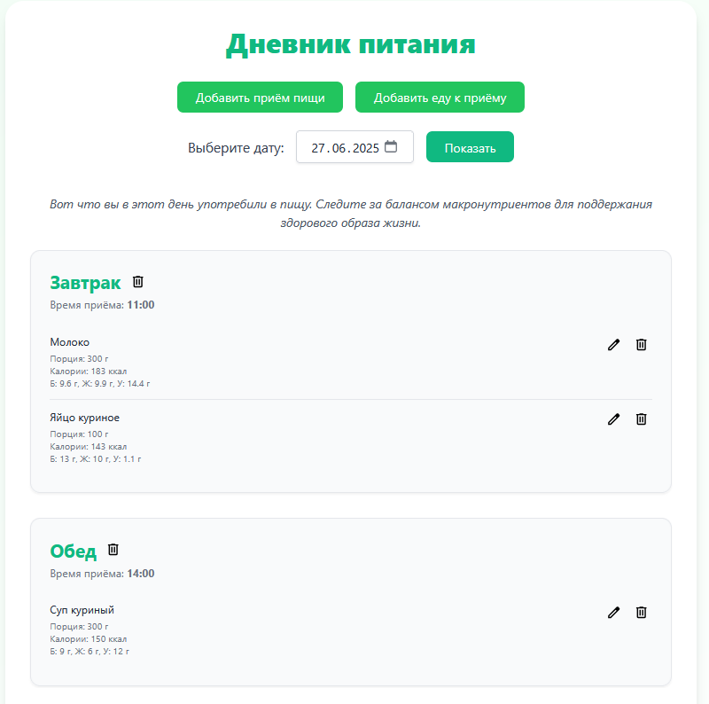
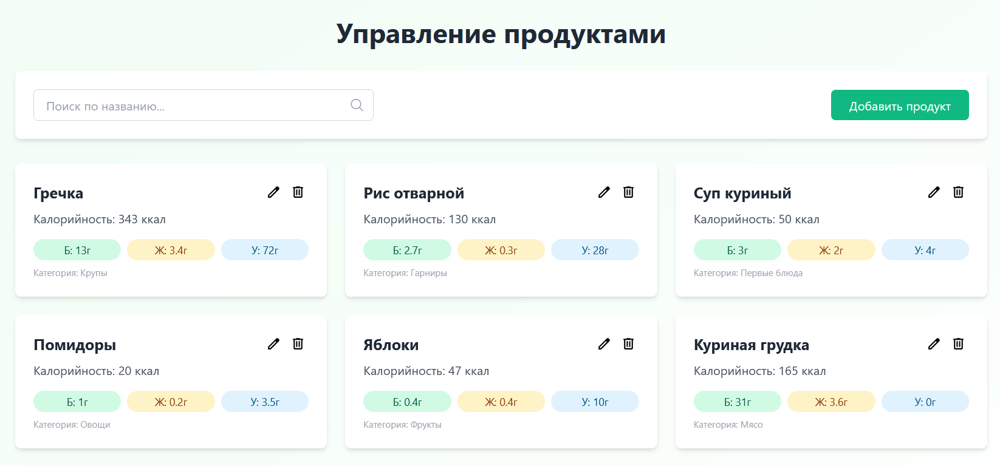
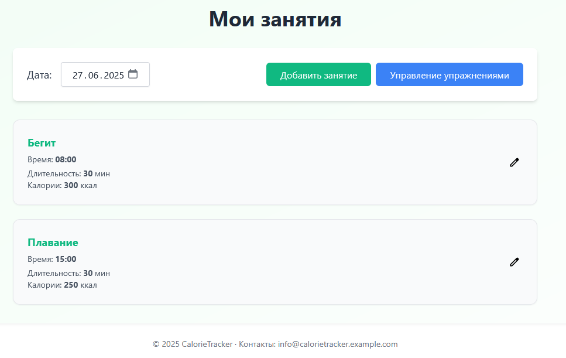
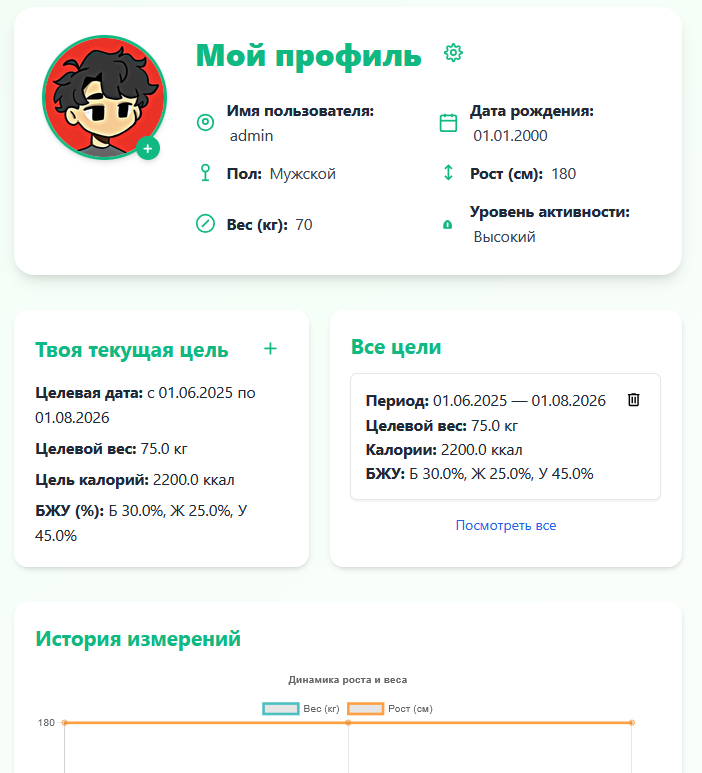
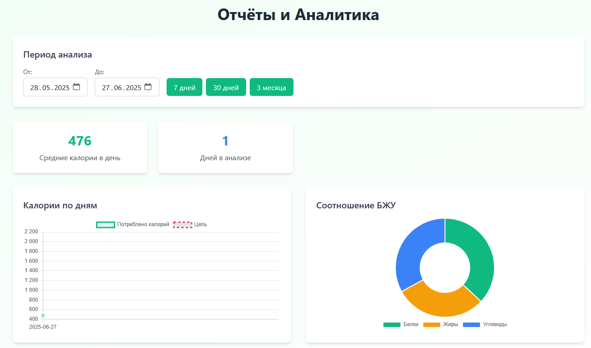
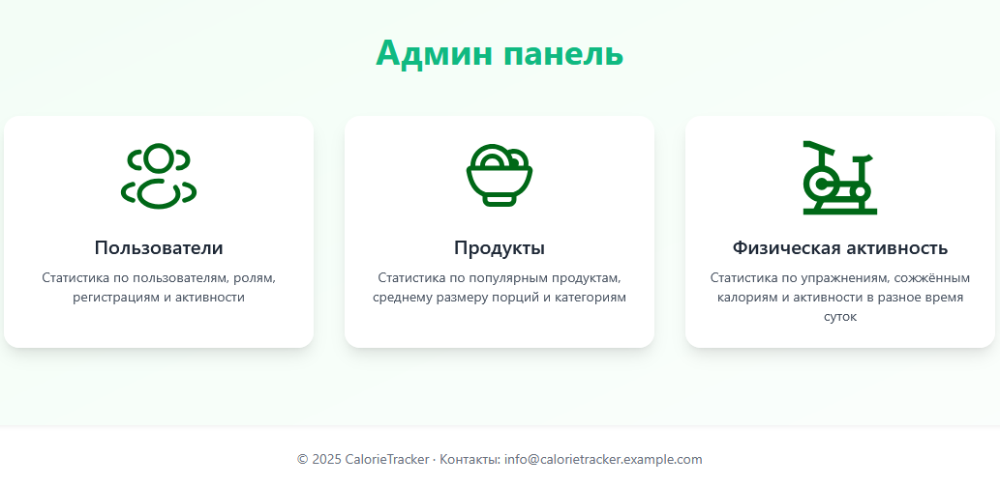

<p align="center">
  
  
  
  
  
  
</p>

<p align="center">
  <strong>Система для учёта калорий, продуктов и физической активности с аналитикой и графиками</strong>
</p>

<table>
  <tr align="center">
    <td rowspan="2" width="70%">
      
    </td>
  </tr>
</table>

---

## 📚 Содержание

- [Описание](#-описание)
- [Функциональность](#-функциональность)
- [Технологии](#-технологии)
- [Интерфейс приложения](#-интерфейс-приложения)
- [Быстрый старт](#-быстрый-старт)
- [Авторы](#-авторы)
- [Лицензия](#-лицензия)

---

## 📝 Описание

**CalorieTracker** — это веб-приложение, позволяющее пользователям отслеживать потребление калорий, управлять списком продуктов и упражнений, вести дневники питания и тренировок, а также просматривать подробную статистику и графики по рациону и активности.

---

## ⚙️ Функциональность

### 🔐 Аутентификация

- Регистрация с хешированием паролей
- Авторизация пользователей

### 🍎 Каталог продуктов

- Добавление/редактирование/удаление продуктов (админ)
- Поиск по названию
- Расчёт КБЖУ на 100г

### 📘 Дневник питания

- Добавление приёмов пищи с порцией (в граммах)
- Автоматический расчёт КБЖУ
- Просмотр общей дневной сводки: суммарные КБЖУ за текущий день
- Редактирование и удаление записей

### 🏋️‍♂️ Каталог упражнений

- Просмотр списка упражнений
- Добавление/редактирование/удаление упражнений (админ)

### 📓 Дневник тренировок

- Учёт продолжительности упражнений
- Автоматический подсчёт сожжённых калорий

### 👤 Профиль пользователя

- Просмотр личной информации
- Отображение аватара пользователя и возможность его изменения
- Отображение целей: целевой вес, калории, БЖУ, период действия
- Управление целями: добавление, редактирование, удаление
- Просмотр истории измерений: рост, вес, изменения со временем

### 📊 Аналитика и отчёты

- Статистика за день, неделю, месяц или произвольный период
- Визуализация данных на графиках
- Админ-аналитика: популярные продукты, активные пользователи, калорийность и т.д.

---

## 🧰 Технологии

<table align="center" style="background-color:#f9f9f9; border-radius:10px; padding:10px;">
  <tr>
    <td align="center" style="padding:10px;">
      
    </td>
    <td align="center" style="padding:10px;">
      
    </td>
    <td align="center" style="padding:10px;">
      
    </td>
    <td align="center" style="padding:10px;">
      
    </td>
    <td align="center" style="padding:10px;">
      
    </td>
    <td align="center" style="padding:10px;">
      
    </td>
    <td align="center" style="padding:10px;">
      
    </td>
    <td align="center" style="padding:10px;">
      
    </td>
    <td align="center" style="padding:10px;">
      
    </td>
    <td align="center" style="padding:10px;">
      
    </td>
  </tr>
</table>

---

## 📸 Интерфейс приложения

<table>
  <thead>
    <tr>
      <th>Раздел</th>
      <th>Скриншот</th>
    </tr>
  </thead>
  <tbody>
    <tr>
      <td>Главная страница</td>
      <td></td>
    </tr>
    <tr>
      <td>Дневник питания</td>
      <td></td>
    </tr>
    <tr>
      <td>Продукты</td>
      <td></td>
    </tr>
    <tr>
      <td>Упражнения</td>
      <td></td>
    </tr>
    <tr>
      <td>Профиль пользователя</td>
      <td></td>
    </tr>
    <tr>
      <td>Аналитика</td>
      <td></td>
    </tr>
    <tr>
      <td>Админ панель</td>
      <td></td>
    </tr>
  </tbody>
</table>

---

## 🚀 Быстрый старт

```bash
git clone https://github.com/PracticeNaumen2025/CalorieTracker.git

cd CalorieTracker

cp .env.example .env
# Отредактируйте .env с вашими настройками

docker compose up -d
```

> ⚠️ **Обратите внимание:**  
> Сервис **Elasticsearch** может требовать подключения к VPN при первом запуске,  
> так как его образ или плагины загружаются с ресурсов, недоступных напрямую из некоторых регионов (например, из РФ).

После запуска система будет автоматически наполнена **примерными тестовыми данными**.
В базу добавлены **2 пользователя** с разными ролями:

| Имя                   | Пароль   | Роль  |
| --------------------- | -------- | ----- |
| [admin](mailto:admin) | admin123 | admin |
| [user](mailto:user)   | user123  | user  |

Вы можете использовать эти учётные данные для входа и тестирования приложения.

Чтобы остановить:

```bash
docker-compose down
```

### 🌐 Сервисы после запуска

| Сервис        | URL                                                                                        | Доступ                               |
| ------------- | ------------------------------------------------------------------------------------------ | ------------------------------------ |
| Приложение    | [http://localhost:8080](http://localhost:8080)                                             | Аутентификация                       |
| Swagger UI    | [http://localhost:8080/swagger-ui/index.html](http://localhost:8080/swagger-ui/index.html) | Пользователь с ролью admin           |
| pgAdmin       | [http://localhost:5050](http://localhost:5050)                                             | `admin@naumen.com` / `admin123`      |
| Java Melody   | [http://localhost:8080/monitoring](http://localhost:8080/monitoring)                       | Пользователь с ролью admin           |
| Redis         | [http://localhost:6379](http://localhost:6379)                                             | —                                    |
| MinIO Console | [http://localhost:9001](http://localhost:9001)                                             | `minioadmin` / `minioadmin123`       |
| MinIO API     | [http://localhost:9000](http://localhost:9000)                                             | — (иконки доступны в бакете `icons`) |
| ElasticSearch | [http://localhost:9200](http://localhost:9200)                                             | —                                    |
| ElasticVue    | [http://localhost:8081](http://localhost:8081)                                             | — (UI для ElasticSearch)             |
| Logstash      | [http://localhost:5044](http://localhost:5044)                                             | — (для сбора логов)                  |

---

## 👥 Авторы

[](https://github.com/Dbatr)

[](https://github.com/GeorgiiMalishev)

---

## 📄 Лицензия

Проект распространяется под лицензией [MIT](LICENSE).

> ⭐ Не забудь поставить звёздочку на репозиторий, если проект тебе понравился!
